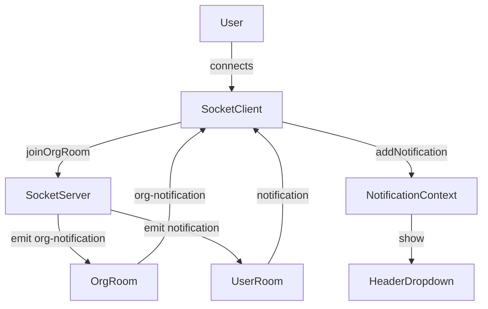

# Socket.io Study Notes

## 1. Project Architecture

**Frontend:**
- Built with React (TypeScript)
- Uses Context API for state management (e.g., `NotificationContext`, `AuthContext`)
- UI components are modularized (e.g., `Header`, `UserSelector`, `Task` components)
- API calls are abstracted in `api.ts`
- Real-time features (notifications) use Socket.IO via `socket.ts`

**Backend:**
- Node.js with Express
- MongoDB for data storage (Mongoose models)
- RESTful API endpoints (e.g., `/api/notifications`, `/api/users`)
- Socket.IO server for real-time communication
- Authentication middleware for protected routes

---

## 2. Organizational Hierarchy

- **Organization**: The top-level entity. Each user belongs to one organization.
- **Teams**: Organizations can have multiple teams. Teams are collections of users.
- **Projects**: Projects belong to organizations and can be associated with teams.
- **Users**: Each user has a role (admin, member, viewer, etc.) and belongs to an organization.
- **Tasks**: Tasks are assigned to users and can be linked to projects and teams.

**Hierarchy Example:**

```
Organization
 ├── Teams
 │    ├── Users
 │    └── Projects
 └── Projects
      └── Tasks
```

- Users can be assigned to teams and projects.
- Permissions and visibility are determined by user roles and their association with teams/projects.

---

## 3. Real-Time Notifications with Socket.IO

### Backend (Server)
- When a notification event occurs (e.g., task assigned), the backend emits a Socket.IO event.
- Users join organization-specific rooms upon connection.
- Notifications can be:
  - **User-specific**: Sent to a single user’s room.
  - **Org-wide (broadcast)**: Sent to the organization’s room (all users in the org).

**Example (server-side):**
```js
io.to(userRoom).emit('notification', notificationData); // user-specific
io.to(orgRoom).emit('org-notification', orgNotificationData); // org-wide
```

### Frontend (Client)
- The Socket.IO client (`socket.ts`) connects and joins the user’s organization room automatically.
- The `NotificationContext` listens for both user-specific and org-wide notification events.
- When a notification is received, it is added to the in-memory notification list.
- Notifications are displayed only in the dropdown under the bell icon in the header (not as toasts/snackbars).

#### Notification Handling
- Each notification in the dropdown can be dismissed (removed locally).
- "Mark All as Read" button marks all user-specific notifications as read in the backend and clears the dropdown.
- Org-wide notifications are only removed locally (no backend persistence for read state).

---

## 4. Key Implementation Details

### Notification API
- `GET /api/notifications`: Fetches all notifications for the authenticated user.
- `POST /api/notifications/mark-seen`: Marks specified notifications as seen in the database.

### NotificationContext
- Fetches notifications on mount.
- Listens for real-time events from Socket.IO.
- Provides methods to add, remove, and clear notifications.

### Header Component
- Displays notification count.
- Shows a dropdown with all notifications.
- "Mark All as Read" button calls the backend for user-specific notifications and clears the dropdown.

### UserSelector Component
- Fetches users for assignment, applies permission-based filtering.
- Uses context to determine which users are assignable based on the current user, project, and task.

---

## 5. Example: Socket.IO Client Join Logic (`socket.ts`)

```ts
import { io } from 'socket.io-client';
const socket = io(API_URL);
socket.on('connect', () => {
  socket.emit('joinOrgRoom', { orgId: user.organization._id });
});
export const socketService = {
  onOrganizationNotification: (handler) => socket.on('org-notification', handler),
  onUserNotification: (handler) => socket.on('notification', handler),
};
```

---

## 6. Visual Diagram: Notification Event Flow



---

## 7. Event Flow (Step-by-Step)

1. **User logs in** and the Socket.IO client connects.
2. **Client emits** `joinOrgRoom` with the user's org ID.
3. **Server adds user** to the org room.
4. When a **notification event** occurs (e.g., task assigned):
    - If user-specific, server emits `notification` to the user room.
    - If org-wide, server emits `org-notification` to the org room.
5. **Client receives** the event and adds it to the notification list in context.
6. **User sees** the notification in the dropdown (bell icon).
7. **User can dismiss** or mark all as read (which calls the backend and clears the dropdown).

---

## 8. Summary
- The architecture is modular, scalable, and real-time ready.
- Organizational hierarchy is enforced at both the data and permission levels.
- Real-time notifications are robust, supporting both user-specific and org-wide events.
- The UI is user-friendly, with clear notification management and feedback.
